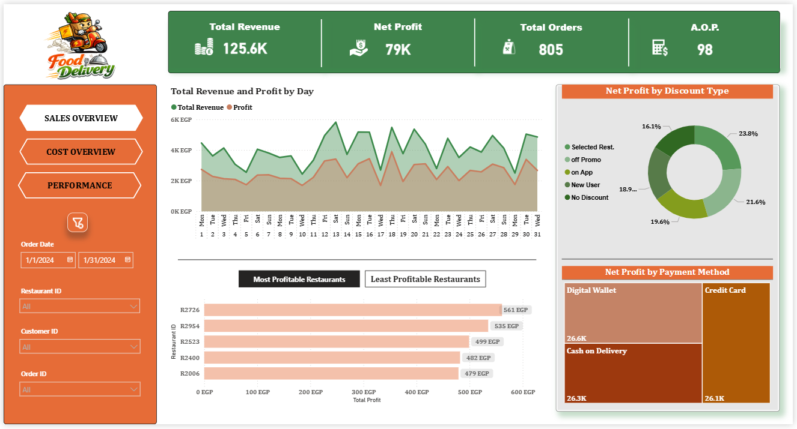
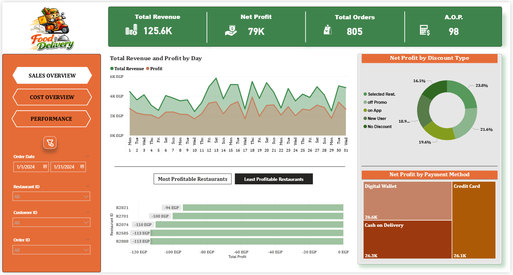
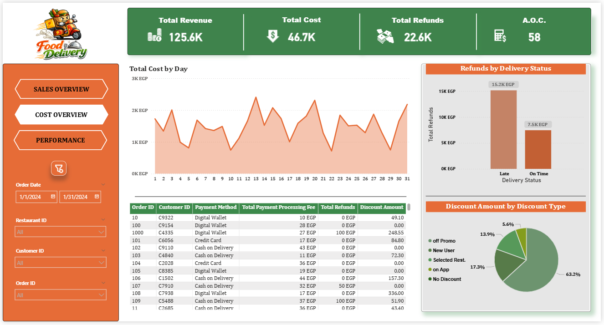
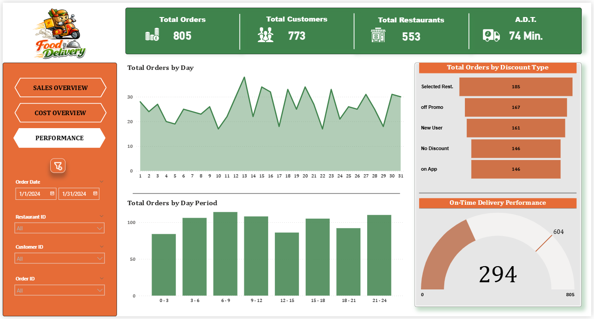

# 📊 Food Delivery Operations Analysis

This project presents a Power BI analysis of a food delivery service, It analyzes Sales trends, Cost components, and Delivery Performance over a one-month period to evaluate financial and operational health including profitability and Delivery efficiency, while identifying key drivers of performance and underlying inefficiencies affecting business outcomes.

---

## 🎯 Objectives

* Analyze revenue over the month and weekdays and identify key drivers
* Evaluate restaurants performance
* Track cost components and detect inefficiencies
* Understand customer ordering patterns and Identify peak hours 
* Evaluate delivery performance

---

## 🛠️ Steps & Tools 

* **Power Query** : Data cleaning and preparation.
* **DAX** : Creation of calendar table and some columns and measures to support the analysis.
* **Power BI** : Data Visualization & dashboarding.

---

## 📈 Dashboards 

  
  
  
  

---

## 💬 Insights

### 💲 Sales Overview

### Key Insights :

* Strong total revenue and profit margins over the month indicate solid financial health.
* Performance over the month is unstable (noticeable  on Wednesdays and Fridays).
* Some restaurants are loss-making, negatively impacting overall profitability.

 ---

### 💸 Cost Overview

### Key Insights :

* Total refunds reached 22.6K, mainly driven by late deliveries.
* Promo code discounts represent the majority of discount costs, yet deliver profitability similar to other discount types.
* Strong average order value contributes positively to overall revenue performance.

---

### 🚀 Performance

### Key Insights :

* Inconsistent ordering patterns.
* Average delivery time is relatively high causing delivery performance inefficiency which leads to customer dissatisfaction and high refund rate.
* Customer retention is low with 773 customers over the month with 805 orders, nearly one order per customer.
* Peak hours occurs between 6 AM and 12 PM indicating a higher concentration from customers on breakfast.

---

## 💡 Business Recommendations

* Apply targeted marketing campaigns to improve demand on low-performing days.
* Re-evaluate underperforming restaurants and implement performance monitoring or quality standards.
* Optimize delivery routes to reduce delivery time and increase drivers during peak hours.
* Optimize discount strategies to protect profit margins.
* Focus on customer retention through loyalty programs.
